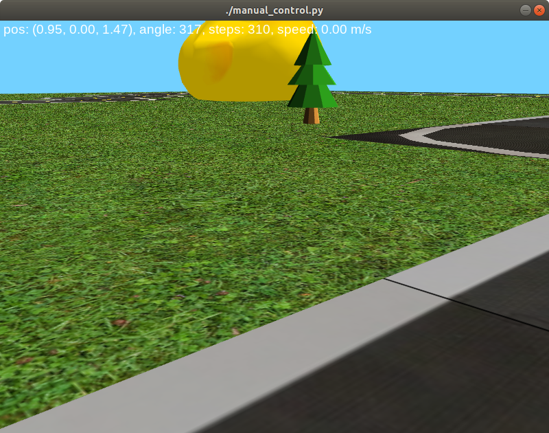

# Deep-Reinforcement-Learning-for-the-Duckietown-AIDO-lf-Challenge

This repository contains the homework of the "Deep Renforcement Learning 101" team for course BMEVITMAV45.

## Table of Contents
1. [Deep Reinforcement Learning for the Duckietown AIDO lf Challenge](#Deep-Reinforcement-Learning-for-the-Duckietown-AIDO-lf-Challenge)
    1. [Introduction](#Introduction)
    2. [Installation](#Installation)
       1. [Installation Requrements](#Insallation-Requrements)
    3. [Usage](#Usage)
    4. [Future Improvements](#Future-Improvements)
    5. [References](#References)

## Introduction
For hour homework for the subject of the Fundamentals of Deep Learning in the Budapest University of Technology and Echonomics, we have chosen to participate in the Duckietown Aido lf challange. In summary the challange is about providing rubber ducks safe travel in their self driving cars in their town: Duckietown. As us we providing the solution for the self driving cars AI. We are commited to help the AI learning for folloing lane that are have dynamic vehicles. More information you can find [here](https://www.duckietown.org/research/ai-driving-olympics). 
 
For solution of our AI, we have chosen the Deep Reinforcement Learning(DRL). DRL uses deep learning and reinforcement learning principles to create efficient algorithms applied on areas like robotics, video games, NLP (computer science), computer vision, education, transportation, finance and healthcare. Implementing deep learning architectures (deep neural networks) with reinforcement learning algorithms (Q-learning, actor critic, etc.) is capable of scaling to previously unsolvable problems. That is because DRL is able to learn from raw sensors or image signals as input.

First we would like to focus on the Reinforcement Learning.(...)

So first we have to create the RL baseline from the duckietown document. This baseline provides us with an algorythm of Deep Deterministic Policy Gradient(DDPG). Deep Deterministic Policy Gradient (DDPG) is a model-free off-policy algorithm for learning continous actions. It combines ideas from DPG (Deterministic Policy Gradient) and DQN (Deep Q-Network). It uses Experience Replay and slow-learning target networks from DQN, and it is based on DPG, which can operate over continuous action spaces. For more information click [here](https://spinningup.openai.com/en/latest/algorithms/ddpg.html)

In the later sections we provide the information that is needed for the installation and the useage of the RL.

For initial map we want to create a new place for the duckies to enjoy their ride, and for creating an enviroment that haven't been used before for not to use an already learnt eviroment.

<p align="center">
<br>
Our map
</p>
 
## Installation

This section provides information about, how the create the baseline for the DRL.

### Insallation-Requrements

- Ubuntu 18.04
- Python 3.6+
- OpenAI gym
- NumPy
- Pyglet
- PyYAML
- cloudpickle
- pygeometry
- dataclasses (if using Python3.6)
- PyTorch or Tensorflow (to use the scripts in `learning/`)

### Installation Steps 


## Useage

Change into the duckietown_rl directory and run the training script
```
$ cd duckietown_rl
$ python3 -m scripts.train_cnn.py --seed 123
```

(Don't bother with the __path__ missing, the DDRG for the test is provided)

When it finishes, check it out (make sure you pass in the same seed as the one passed to the training script)
```
$ python3 -m scripts.test_cnn.py --seed 123
```

## Future-Improvements

For further improvements, we would like to implement our own algorythm.

